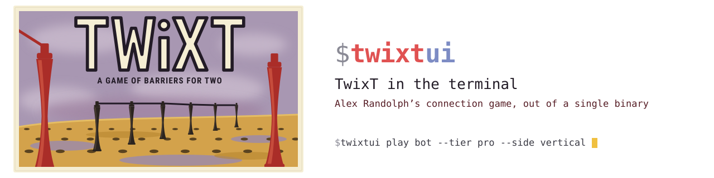

<p align="center">
  <picture>
    <source media="(prefers-color-scheme: dark) and (max-width: 480px)" srcset="assets/banner-compact-dark.svg">
    <source media="(max-width: 480px)" srcset="assets/banner-compact-light.svg">
    <source media="(prefers-color-scheme: dark)" srcset="assets/banner-dark.svg">
    
  </picture>
</p>

# twixtui

TwixT in the terminal: play Alex Randolph's connection game against a bot, against
someone at the same keyboard, or against someone on another machine, without leaving
your shell.

## A quick introduction

https://github.com/user-attachments/assets/79156074-db7b-4ff5-8eea-bd15964c176f

An earlier illustrated tour of the menu, a 24×24 board, hints, remote play,
standings and four colour schemes. About a minute; not a recording of the current
release. The manual describes today's four effort tiers and placement-only advice.

<p align="center">
  <a href="docs/MANUAL.md"></a>
</p>

<p align="center">
  <a href="#quick-start">Quick start</a> · <a href="docs/rules.md">Rules</a> · <a href="docs/MANUAL.md">Manual</a> · <a href="CHANGELOG.md">Changelog</a> · <a href="https://github.com/BAKocska/twixtui/releases/latest">Releases</a>
</p>

<p align="center">
  <a href="https://github.com/BAKocska/twixtui/actions/workflows/ci.yml"></a> <a href="https://github.com/BAKocska/twixtui/releases/latest"></a>
   <a href="LICENSE"></a> 
</p>

> [!NOTE]
> One static binary, built without cgo, nothing to install alongside it — so it plays over SSH, in a pane beside your work, or on a machine with no display server.

TwixT is a two-player connection game. The board is a square grid of holes; each turn you
place one peg and join your own pegs with links a chess knight's move apart. A link blocks
any other link whose line it crosses — including your own — so the game becomes a running
argument about which crossings you can afford to give away. One player connects top to
bottom, the other left to right. Randolph devised it on paper in Vienna in 1957; 3M put it
in a box in 1962. A terminal is a good place for it: the board is a grid of discrete
positions joined by short straight lines, which is what a character cell grid is already
good at drawing, and nothing here wants a mouse.


## Install

macOS and Linux:

```
go install github.com/BAKocska/twixtui/cmd/twixtui@latest
```

Go 1.26 or newer. Or take a prebuilt binary — macOS or Linux, arm64 or x86-64, with
`checksums.txt` beside it — from the
[releases page](https://github.com/BAKocska/twixtui/releases/latest). On macOS a binary
downloaded through a browser needs its quarantine attribute cleared first;
[the manual](docs/MANUAL.md#download-a-binary) has that and the checksum command.

**Windows support is unreleased.** Build this checkout in PowerShell; the current
`v0.4.0` release has no Windows ZIPs:

```
go build -o twixtui.exe ./cmd/twixtui
.\twixtui.exe
```

Keep `go.work` in the checkout: it pins the Windows input-decoder fix.
Versioned `go install ...@version` does not use that override; Windows builds
currently require the checkout or a packaged ZIP.

[The manual](docs/MANUAL.md#on-windows) has the terminal to run it in, where it keeps
its state, and what the test suite needs.

## Quick start

```
twixtui                                               # the menu, and a name the first time
twixtui play bot --tier intermediate --side vertical  # one game against the bot
twixtui play local                                    # two players, one keyboard
twixtui learn                                         # the interactive tutorial
twixtui help                                          # every command, with what it is for
```

## What's in the box

| | |
| --- | --- |
| [Play a bot](docs/MANUAL.md#playing-a-bot) | Four effort tiers: `beginner`, `intermediate`, a clock-bounded `pro`, and `max`, the largest effort on offer. Hints use `max`'s placement-only search under a two-second guard: advice, not a proof of best play. |
| [Hotseat](docs/MANUAL.md#hotseat) | Two players, one terminal, alternating turns. |
| [Remote play](docs/MANUAL.md#remote-play) | Direct, through a relay you or your opponent runs, or by correspondence with no live connection at all. |
| [Learn it](docs/MANUAL.md#the-tutorial) | Seven lessons taught by playing them, and a five-step introduction on [first run](docs/MANUAL.md#the-first-run). |
| [Profiles & standings](docs/MANUAL.md#profiles) | Local names with no passwords, a [leaderboard](docs/MANUAL.md#the-leaderboard), and saved games you can move between machines. |
| [Review a game](docs/MANUAL.md#reviewing-saved-games) | A numbered entry list, `:` to jump to an entry, and the winning chain highlighted at the final position. Read-only, including imported records. |
| [Honest rulesets](docs/MANUAL.md#rulesets) | `std`, `pp` and `classic` make each historical disagreement an explicit setting; boards from 6×6 to 48×48. |
| [Themes & cover art](docs/MANUAL.md#themes) | Four colour schemes, and the [1962 box lid](docs/MANUAL.md#the-cover) drawn beside the menu in character cells. |
| [Shell completion](docs/MANUAL.md#shell-completion) | `bash`, `zsh`, `fish` and `powershell`, each value carrying its own one-line explanation. |

The tiers are measured rather than assumed: on colour-balanced opening pairs,
`intermediate` beat `beginner` 24–0 on each of three board sizes. The protocol,
and how much of an edge `pro` and `max` do and do not establish, are in
[the manual](docs/MANUAL.md#playing-a-bot).

## Licence

MIT. See [LICENSE](LICENSE).

TwixT was designed by Alex Randolph. This is an independent implementation, not
affiliated with, endorsed by, or licensed from any publisher of the board game.
