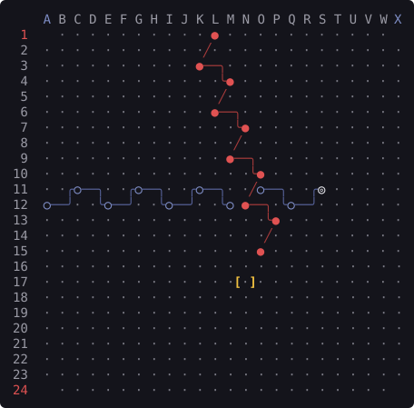

# twixtui manual

Everything `twixtui` does, in one file. The short version, and the quickest way
in, is [README.md](../README.md).

The rules the program implements, the handful of points where historical
editions genuinely disagree, and where every rule comes from are written up
separately in [rules.md](rules.md), with the source audit trail in
[RULES-PROVENANCE.md](RULES-PROVENANCE.md).

## Contents

- [Install](#install)
  - [With Go](#with-go)
  - [Download a binary](#download-a-binary)
- [Quick start](#quick-start)
- [The first run](#the-first-run)
- [The menu](#the-menu)
- [Commands](#commands)
- [The board](#the-board)
- [Keybindings](#keybindings)
- [Playing a bot](#playing-a-bot)
- [Hotseat](#hotseat)
- [Remote play](#remote-play)
- [The tutorial](#the-tutorial)
- [Profiles](#profiles)
- [The leaderboard](#the-leaderboard)
- [Rulesets](#rulesets)
- [Themes](#themes)
- [The cover](#the-cover)
- [Shell completion](#shell-completion)
- [Building from source](#building-from-source)

## Install

### With Go

```
go install github.com/BAKocska/twixtui/cmd/twixtui@latest
```

Go 1.26 or newer. The binary lands in `$(go env GOPATH)/bin`.

### Download a binary

Every release publishes binaries for four platforms, built without cgo so they carry
no third-party dependencies. Take the
archive for yours from the
[releases page](https://github.com/BAKocska/twixtui/releases/latest):

| Platform | Archive |
| --- | --- |
| macOS, Apple silicon | `twixtui_<version>_darwin_arm64.tar.gz` |
| macOS, Intel | `twixtui_<version>_darwin_amd64.tar.gz` |
| Linux, arm64 | `twixtui_<version>_linux_arm64.tar.gz` |
| Linux, x86-64 | `twixtui_<version>_linux_amd64.tar.gz` |

Unpack it and put `twixtui` somewhere on your `PATH`:

```
tar xzf twixtui_<version>_darwin_arm64.tar.gz
sudo install -m 755 twixtui /usr/local/bin/twixtui
twixtui version
```

Every release also ships `checksums.txt`, so you can check what you downloaded:

```
shasum -a 256 -c checksums.txt --ignore-missing
```

**On macOS**, a file downloaded through a browser carries a quarantine attribute and
Gatekeeper refuses to run it — "cannot be opened because the developer cannot be
verified". These binaries are not signed or notarised, so clear the attribute yourself:

```
xattr -d com.apple.quarantine ./twixtui
```

Downloading with `curl -LO` instead of a browser avoids the attribute altogether, since
`curl` does not set it.

## Quick start

```
twixtui                                               # the menu, and a name the first time
twixtui play bot --tier intermediate --side vertical  # one game against the bot
twixtui play local                                    # two players, one keyboard
twixtui learn                                         # the interactive tutorial
twixtui help                                          # every command, with what it is for
```

Start with the first line. Playing a game needs a profile to record it against,
and the bare command takes a name when the machine has none; on a machine with no
profiles `--profile NAME` will make one too.

## The first run

The first time a profile opens the interactive mode it meets a short
introduction: five steps on a real board, showing what the game is, whose borders
are whose, that a turn is one peg, how links form, and that links block. Each
step invites a move rather than requiring one, and nothing in it refuses to
advance.

It is skippable at every step and the key that skips is named on every step. It
is shown once per profile and never again, and skipping counts as having seen it:
somebody who skipped does not want it again tomorrow. `Learn to play` on the menu
has an entry that replays it deliberately, next to the seven-lesson tutorial it
points at.

The flag belongs to the profile rather than to the machine, so a second person
with their own profile on a shared machine is still a newcomer.

## The menu

`twixtui` with no arguments opens the front screen, which is grouped by how often
somebody does the thing rather than by the mechanism behind it:

| Entry | What is behind it |
| --- | --- |
| `Play` | A new game. Who is on the other side is the first question — the computer, somebody at this keyboard, or somebody on another machine — and the questions after it depend on the answer. Escape walks back through them. |
| `Continue a saved game` | The games still waiting for a move. A network game that has lost its connection, and a game imported from elsewhere, are listed but cannot be played on, and the row says why. |
| `Watch a finished game` | Step through a finished game, including one imported from another machine. |
| `Learn to play` | The tutorial, the written rules, and the introduction again. |
| `Leaderboard` | The standings, and one player's history. |
| `Settings` | Colours, the default ruleset, the default board size, whether hints are offered, and which profile is playing. Set once and forgotten; kept per machine, as the colour scheme is. |
| `Quit` | Leave. `q` does the same from the front screen. |

Every level is leavable by escape and the way out is named on the screen. The
cover artwork appears beside the menu when the terminal is wide enough for both;
it never costs an entry, so at eighty columns there is simply no picture.

## Commands

| Command | What it is for |
| --- | --- |
| `twixtui` | Interactive mode: the menu, and a profile first if none has been chosen yet. No flags to remember. |
| `twixtui play bot` | Play the built-in bot at one of four efforts, `beginner` to `max`. |
| `twixtui play local` | Hotseat: two players taking turns at the same terminal. |
| `twixtui play host` | Offer a live game to a remote opponent. |
| `twixtui play join` | Accept a remote opponent's live game. |
| `twixtui play correspondence` | Play by exchanging move codes, with no live connection at all. |
| `twixtui learn` | Interactive lessons: the rules, then the ideas behind them. |
| `twixtui profile` | `list`, `create`, `use`, `rename`, `delete`, `whoami` — the local usernames games are recorded against. |
| `twixtui leaderboard` | `show`, `reset` — standings and per-player history. |
| `twixtui game` | `list`, `show`, `replay`, `export`, `import`, `delete` — saved games: browse them, step through them, move them between machines. |
| `twixtui rules show` | Print the rules, or one topic of them, and the sources behind them. |
| `twixtui serve` | Run the relay that pairs two remote players. |
| `twixtui theme` | `list`, `set`, `show` — colour schemes. |
| `twixtui completion` | Emit a completion script for `bash`, `zsh`, `fish` or `powershell`. |
| `twixtui version` | Version, commit and build date of this binary. |

Every command accepts these:

| Flag | Effect |
| --- | --- |
| `--profile NAME` | Play this one command as that profile, without changing the stored choice. |
| `--config DIR` | Read and write state under `DIR`. Also settable as `TWIXTUI_CONFIG_DIR`. |
| `--theme NAME` | Theme for this run only; does not change the saved choice. |
| `--no-color` | No colour. `NO_COLOR` in the environment does the same. |

Explicitly empty values are errors: `--config ""`, `--profile ""`, and
`--theme ""` do not silently fall back to another directory, player or scheme.
The same applies to a present-but-empty `TWIXTUI_CONFIG_DIR`; unset it to use
the default location. This matters in scripts whose configuration variable may
not have been set.

## The board

A 24×24 game in progress, drawn at the compact scale, which puts neighbouring holes
two columns and one row apart. The renderer switches to a larger scale, four
columns and two rows, when the terminal is big enough for it. First, the position
exactly as the program prints it — the verbatim monochrome shape every theme
starts from:

```
    A B C D E F G H I J K L M N O P Q R S T U V W X
 1    · · · · · · · · · · ● · · · · · · · · · · ·
 2  · · · · · · · · · · ·╱· · · · · · · · · · · · ·
 3  · · · · · · · · · · ●──╮· · · · · · · · · · · ·
 4  · · · · · · · · · · · ·╰● · · · · · · · · · · ·
 5  · · · · · · · · · · · ·╱· · · · · · · · · · · ·
 6  · · · · · · · · · · · ●──╮· · · · · · · · · · ·
 7  · · · · · · · · · · · · ·╰● · · · · · · · · · ·
 8  · · · · · · · · · · · · ·╱· · · · · · · · · · ·
 9  · · · · · · · · · · · · ●──╮· · · · · · · · · ·
10  · · · · · · · · · · · · · ·╰● · · · · · · · · ·
11  · ·╭○──╮· ·╭○──╮· ·╭○──╮· ·╱○──╮· ·╭◎ · · · · ·
12  ○──╯· ·╰○──╯· ·╰○──╯· ·╰○ ●──╮·╰○──╯· · · · · ·
13  · · · · · · · · · · · · · · ·╰● · · · · · · · ·
14  · · · · · · · · · · · · · · ·╱· · · · · · · · ·
15  · · · · · · · · · · · · · · ● · · · · · · · · ·
16  · · · · · · · · · · · · · · · · · · · · · · · ·
17  · · · · · · · · · · · · ·[·]· · · · · · · · · ·
18  · · · · · · · · · · · · · · · · · · · · · · · ·
19  · · · · · · · · · · · · · · · · · · · · · · · ·
20  · · · · · · · · · · · · · · · · · · · · · · · ·
21  · · · · · · · · · · · · · · · · · · · · · · · ·
22  · · · · · · · · · · · · · · · · · · · · · · · ·
23  · · · · · · · · · · · · · · · · · · · · · · · ·
24    · · · · · · · · · · · · · · · · · · · · · ·
```



The same position again, in the colours the `classic` theme actually emits.
Colour only ever reinforces the glyphs; no distinction on this board depends
on it, which is what lets `mono` and `NO_COLOR` drop it entirely.

Boards wider than 26 columns use two header rows: read a column's letters
vertically, so `AA`, `AB` and later labels stay separate at the compact scale.
The letters remain directly above their holes; the board and link geometry do
not change. A narrow terminal scrolls the viewport rather than wrapping it.

`●` is the vertical player, who connects the top border row to the bottom one;
`○` is the horizontal player, connecting left to right. `·` is an empty hole,
`[·]` is the cursor, and `◎` is the peg just played — `◉` when it is vertical's.

The strokes between pegs are links. A link one column across and two rows deep is
steep enough for a plain diagonal, `╱` or `╲`. One that goes two columns across and
only one row down covers four screen columns for every row it descends, far
shallower than any diagonal a cell can draw, so it is drawn as a connected run of
`─` with corners `╭ ╮ ╰ ╯`, and a tee or a cross — `├ ┤ ┬ ┴ ┼` — where two links
leave a peg on the same side and share a run. Where two links that cross reach the
same cell, that cell gets `╳`, because a tee there would say they meet. Two
crossing links need not reach the same cell — at the compact scale two crossing
steep links land one directly above the other — and then nothing is marked: the
only cell a mark could go in belongs to one of the two links, and taking it would
erase that link. A peg a run has to pass through is drawn as `⊕` or `⊖`, which says
both things at once and still names its owner.

The cursor and a highlight sit as brackets either side of a hole, `[ ]` and `( )`.
Where a link already owns those cells a bracket would erase it, so the mark goes on
the hole itself instead: `◇ ◆ ◈` for the cursor, `□ ■ ▣` for a highlight, `△ ▲ ▽`
for a highlighted hole with the cursor on it. Outline is an empty hole, solid is
vertical and the third form is horizontal, so a mark never hides what the hole
holds.

Vertical has an unbroken chain from L1 all the way down to O15. Horizontal's runs
from the left edge at A12 as far as M12 and then stops: the link it wants from M12
to O11 is blocked, because vertical's link from O10 to N12 crosses it. That is the
whole game in one picture — every link you build is also a wall.

## Keybindings

The board is driven from the keyboard, vim-style. The bindings are unmodified
printable keys, plain uppercase letters, and the basic special keys — the arrows,
space, enter, escape and ctrl+c. Modified arrows and protocol-dependent
combinations are not reliable inside a terminal multiplexer, so the keymap uses
none of those.

| Key | Action |
| --- | --- |
| `h` `j` `k` `l`, or the arrow keys | Move the cursor one hole. |
| `H` `J` `K` `L` | Jump three holes. |
| `g` / `G` | Jump to the top / bottom edge. |
| `0` / `$` | Jump to the left / right edge. |
| `space` | Place a peg in the hole under the cursor. |
| `enter` | Places the peg when none is staged yet, and commits the turn once one is. |
| `x` | Enter or leave link mode. |
| `1`-`8` | Only in link mode: toggle the link in that direction. |
| `esc` | Leave link mode. |
| `a` | Abort the turn: the board goes back to how it stood when your turn began. |
| `?` | In a bot game: the move the bot would play, and why. |
| `s` | Take the swap option, while it is on offer. |
| `d` | Offer a draw, or accept the one on offer. |
| `r` | Resign. |
| `q` | Leave the game. Started from the menu, it goes back to the menu; started from the command line, there is nothing behind it, so the program ends and the game is saved. |
| `ctrl+c` | Leave the game and end the program, saving it either way. |

Placing a peg offers every link that peg can legally make, and link mode is where you
turn those on and off: the eight knight's-move directions around the cursor are
numbered, and the digit keys toggle them. Nothing is final until you commit the turn,
so a link you regret is one keystroke away from being undone.

## Playing a bot

```
twixtui play bot --tier beginner --side vertical
twixtui play bot --tier intermediate --side horizontal
twixtui play bot --tier pro --side random
twixtui play bot --tier max --side vertical
```

A tier controls work, not a guaranteed strength or attained depth. All four use
the same connection-graph evaluation and alpha-beta search; `pro` and `max`
also use principal-variation search and a transposition table.

| Tier | Depth ceiling | Root / interior shortlist | Time guard |
| --- | ---: | ---: | ---: |
| `beginner` | 1 | 6 / 6 | 100 ms |
| `intermediate` | 3 | 18 / 14 | 1 s |
| `pro` | 16 | 24 / 18 | 3 s |
| `max` | 24 | 48 / 32 | 10 s |

The beginner scores distance alone and samples among candidates; intermediate
uses distance, bottlenecks and territory. Pro and max extend forced lines by
up to six and eight extra plies respectively. Exact tactical defence lists are
not width-capped. Depths are ceilings, not promises: the clock can stop any tier
early, while an immediate win needs no deep search. The maximum tier deliberately
spends more work on a broader shortlist; it is not guaranteed to beat pro in
every position or on every board size.

What every tier plays is a peg, with the links that peg is offered taken as they come.
The bot never turns a link off, never takes one of its own links back on a later turn
and never uses the swap option, so under `--ruleset std` it is playing a subset of the
moves the printed rules allow while you have all of them. Its search is selective too:
it looks at a shortlist of holes per position rather than at every legal one. Nothing
here solves TwixT, and no tier's move is a proven best move.

Effort and strength are checked separately. Regression tests compare search
values and chosen moves against full-width minimax, check exact node boundaries,
and verify cancellation, position restoration and immediate tactics. The
opt-in tournament measures outcomes on colour-balanced opening pairs. A draw
scores a half; an error aborts, and an unfinished game is never scored as a draw.
Incomplete pairs prohibit a directional strength verdict.

A fresh confirmation sample on 7 September 2026 used opening seeds 101–112,
disjoint from development seeds 1–12. Each board/pairing played 24 games,
both colour assignments per opening, under `std` with swap disabled and the
bot's automatic-link policy. Results below are **W–L–D for the left-hand bot**:

| Comparison | 10×10 | 16×16 | 24×24 |
| --- | ---: | ---: | ---: |
| Intermediate vs beginner | 24–0–0 | 24–0–0 | 24–0–0 |
| Pro, 8,000 nodes, vs intermediate | 19–5–0 | 15–6–3 | 20–4–0 |
| Max, 32,000 nodes, vs pro, 8,000 nodes | 11–12–1 | 13–9–2 | 17–6–1 |
| PVS, 2,000 nodes, vs untrained MCTS, 256 simulations | 19–5–0 | 20–3–1 | 22–2–0 |

These 288 games all finished; none errored or was truncated. Alpha-beta's
one-hour clock was a safety guard and never bound. **They do not measure the
shipped three- and ten-second budgets.** The conservative two-sided 95% bound
treats the twelve opening pairs, not the twenty-four games, as the sample:
`mean ± sqrt(log(40)/(2 × pairs))`, clipped to [0,1]. It supports intermediate's
advantage over beginner on all three sizes, and PVS's advantage over this MCTS
configuration on 24×24. The other comparisons remain inconclusive under that
rule, including every max-versus-pro result. The result describes this opening
sample, not every possible position.

MCTS is retained as an opt-in research contender, not selected as a shipped
tier. Its cap is in simulations, not alpha-beta nodes. Actual total analyses
in the 24×24 confirmation were 704,433 for PVS and 792,452 for MCTS, including
tactical probes. Max's 24×24 match used 21,251,889 analyses against pro's
5,465,733; both had median completed depth four. Broader search consumes work
that a depth number alone does not reveal.

Principal-variation search was also compared with plain alpha-beta on 36
development positions at depth five. Median analysis savings were 0.8–1.6%
depending on board size, much smaller than the geometry optimization. Two
scores and one chosen move differed: history-dependent shortlist selection
means this is not a claim of identical selective trees. Full-width minimax
regressions establish pruning correctness separately.

A killer-move ordering lever exists in the search and is off in every tier,
because measuring it against a contender identical but for that lever did not
support turning it on. At full width, where the candidate list is the
position's own and ordering cannot change a value, twelve frozen midgames at
depth four returned identical values in both configurations measured: 29.8%
fewer nodes with neither principal-variation search nor the transposition
table, 12.0% fewer with both. No tier searches at full width. At pro's shipped
shortlist the result is depth-dependent and the values are not identical: over
40 measured positions on 10×10 and 16×16 with opening seeds 1–12, total nodes
were 6.8% worse at depth five, 2.9% better at depth six and 6.8% better at
depth seven, while the median position was unchanged at every depth and six
to eight positions per depth returned a different score — shortlist selection
depends on search history, so this is an ordering change that can change what
is searched. A paired match at an equal 8,000-node budget over opening seeds
1–12, both colours, was 12–11–1 on 10×10 and 9–13–2 on 16×16 for the killer
side; the conservative bound spans 0.5 in both cases, so neither establishes a
strength difference in either direction. The lever stays available to the
effort benchmark as the `pvs-killers` pair.

An aspiration window at the search root was implemented, measured and left off.
It searches the root's first move inside a two-peg band around the previous
iteration's score, widening the failing side to the whole scale so that a root
score is always a measurement and never a bound. On the 40 frozen positions of
10×10 and 16×16, seeds 1–12, every one reaching depth six on both sides, the
band spent **3.4% more** nodes than the whole window rather than fewer
(+0.8%, −0.8%, +6.0% and +1.8% across the four board-and-setup cells), and
13.0% more at depth eight on 10×10; no band between one and forty-eight pegs
saved any. The reason is measurable rather than guessed: the root score moves
by more than two pegs from one iteration to the next on a third of them, so a
third of iterations pay to re-search the root's largest subtree. Twenty-four
games a side at 8,000 nodes were 11–11–2 on both 10×10 and 16×16 with all
twelve opening pairs level, a conservative bound of 0.11–0.89, and no strength
difference established in either direction — and 11 of 12 pairs on 10×10 played
an identical game whichever side held the band, so the match had little to
distinguish. The chosen move agreed on all 40 positions; two reported scores
differed, which is the same history- and table-dependent selective tree noted
above for principal-variation search and not a bound escaping the window.

The evaluator caches immutable board geometry instead of recomputing knight
neighbours and border scans at every node. Against revision `312d9ce`, five
single-CPU warm-load benchmark samples had these medians:

| Board | Before | Cached geometry | Reduction |
| --- | ---: | ---: | ---: |
| 10×10 | 4,524 ns/evaluation | 3,385 ns/evaluation | 25.2% |
| 24×24 | 28,115 ns/evaluation | 18,498 ns/evaluation | 34.2% |

Both paths allocated zero bytes per warm evaluation. On 30 frozen positions
covering 6×6 through 48×48, isolating this optimization preserved every recorded
distance/score, chosen move, completed depth and node count. These are warm
evaluator measurements on an Apple M5 Pro with Go 1.26.5, not cold-start timings
or a claim that every search speeds up by the same percentage.

The search also fixes a distinct correctness problem: an upper-bound score
could tie the principal variation and win the root's positional tie-break,
causing the bot to choose a losing move while reporting a favourable score.
The regression checks the chosen move's actual minimax value, not just the
number reported by the search.

| Flag | Effect |
| --- | --- |
| `--tier beginner\|intermediate\|pro\|max` | How much effort the bot may spend. |
| `--side vertical\|horizontal\|random` | Which connection you take. Required: there is no default. |
| `--ruleset std\|pp\|classic` | Which ruleset to play under. |
| `--size N` | Board side length, 6 to 48. |
| `--seed N` | Fix the bot's random seed. |
| `--hints` | Whether `?` may ask for advice on your turn. On by default. |

You pick your side before the first move, and on the command line `play bot` will
not start without it: leave `--side` out and it says so. The menu asks instead.
`--side random` is there for players who would rather not choose.

`--seed N` fixes random choices, not the amount of search completed. Repeating a
seed is reproducible when the same deterministic work finishes; a deadline or a
loaded machine can stop even a normally depth-capped tier earlier. For repeatable
experiments, `bot.NewWithLimits(tier, seed, bot.Limits{Nodes, Depth, Time})`
overrides the chosen guards (zero inherits the preset). `bot.StatsOf` reports
recursive nodes, all position analyses including tactical probes, completed
depth, elapsed search time and the actual stop reason. Nodes and analyses are
different quantities; neither is an MCTS simulation count.

Asking for a hint runs the same search with the highest-effort settings the package
has, whichever tier you are playing, and gives you the move it would play, a line on
why, and the holes that reason is about, marked on the board. It keeps a two-second
guard rather than the ten seconds `max` may take in a game, so it can finish at a
shallower depth. A hint is refused while a turn has uncommitted edits: commit or
abort it first. Interrupted analysis never presents a partial list of replies
as an exact count. Hints are available by default; `--hints=false` disables them.

### Reproducing bot experiments

The ordinary suite runs tactical and effort regressions. The larger experiment
is opt-in and writes its resolved configuration, every move, work counters,
game result and paired uncertainty to JSON:

```sh
TWIXT_BOT_EFFORT=1 \
TWIXT_BOT_EFFORT_MODE=match \
TWIXT_BOT_EFFORT_CANDIDATES=pro,intermediate \
TWIXT_BOT_EFFORT_SIZES=10,16,24 \
TWIXT_BOT_EFFORT_SEED_START=101 TWIXT_BOT_EFFORT_SEED_COUNT=12 \
TWIXT_BOT_EFFORT_NODES=pro=8000 TWIXT_BOT_EFFORT_TIME=1h \
TWIXT_BOT_EFFORT_OUT=/tmp/twixt-effort.json \
go test ./internal/bot -run '^TestBotEffortExperiment$' -count=1 -timeout=30m
```

This example measures pro's search policy under an 8,000-node limit, not the
shipped three-second pro budget. `MODE=positions` probes fixed positions;
setup games that already ended are recorded as terminal slots, never silently
replaced by earlier positions. `plain` and `pvs` isolate the search algorithm;
`mcts` runs the untrained Monte Carlo alternative, with its simulation count
set by `TWIXT_BOT_EFFORT_ITERATIONS`. Per-candidate overrides use `name=value`.
The full interface and protocol live in `internal/bot/effort_benchmark_test.go`.

### Perfect play

None of these bots is a perfect TwixT player. On an empty 24×24 board a side has
528 legal peg placements; the search keeps only a shortlist. Standard rules
also permit deliberate link additions/removals, which this move API does not
search, and optional peg removal can introduce cycles.

An exhaustive experiment solved 32 selected late 6×6 paper-and-pencil positions
after 26 placements, with six empty playable holes, swap disabled and permanent
automatic links. A separate clone-based minimax agreed on each result and
verified that each selected move was optimal; injected scoring, illegal-move
and failed-undo defects were detected. This is a small
endgame experiment using the game's rules engine, not a solution of the initial
6×6 board, a strategy certificate, or evidence of perfect 24×24 play.

[Generalized TwixT is PSPACE-complete](https://arxiv.org/html/1403.6518#S3);
that is not an impossibility proof for a fixed 24×24 board. Stronger practical
play could use a trained policy/value network with MCTS, but it needs a
rule-matched model: the public
[twixtbot-ui model](https://github.com/stevens68/twixtbot-ui#evaluation)
was trained with own-link crossings allowed and documents evaluation errors
when that rule is switched off. Results for this project's untrained MCTS
experiment do not measure trained neural MCTS.

## Hotseat

```
twixtui play local --ruleset std --size 24
```

Two players, one terminal, alternating turns.

## Remote play

Two people each run `twixtui` on their own machine. There are three ways to connect, in
descending order of directness, and all three carry the same game protocol.

**Direct.** One player listens, the other dials in. Nothing but the binary is involved.
The listening side has to be reachable: the same LAN, a tailnet or WireGuard address, or
a forwarded port.

Direct hosting listens on all interfaces by default. Use `--bind` to choose a
specific interface address and `--port` to choose its port, for example
`twixtui play host --bind 127.0.0.1 --port 4270` for local-only play or testing.
Direct play has no transport authentication or encryption: a reachable client
receives the host's player name and rules during the initial handshake. Use a
trusted network or a VPN when those details should not be public.

```
# on the host's machine, listening on the default port 4270
twixtui play host --side vertical

# on the opponent's machine
twixtui play join host.example:4270
```

**Through a relay.** When neither side can accept an inbound connection — CGNAT, hotel,
campus or mobile networks — both sides dial out to a relay instead, and the relay pairs
them. The host prints a 22-character pairing code in three dashed groups; the opponent
needs all of it, not just the first group.

The relay is the same binary in another mode, and it pumps bytes without ever parsing
the game. Only the first group of the pairing code is sent to it; both ends derive a key
from the rest, which the relay is never told, and authenticate every frame with it. So a
relay cannot alter, inject, replay or drop a move without being caught. It does read
everything it carries, in plain text: both names, the ruleset and every move. Use a
relay you or your opponent runs, or one you are content to be read by.

```
# whoever has a reachable machine; default port 4271
twixtui serve --addr :4271

# the host, which prints a pairing code to pass on
twixtui play host --relay relay.example:4271

# the opponent, with the code they were given
twixtui play join K7MDPQ-3FHJ8TWZ-Q2XVNR5B --relay relay.example:4271
```

Both live transports behave the same once the two ends are talking. The host
chooses the ruleset, the board size and its own side — `--ruleset`, `--size`,
`--side`, with `--port` for a direct game on a port other than 4270 — and the
joining copy takes them from the handshake. Protocol version and ruleset are
compared as part of that handshake, so mismatched builds or mismatched rules are
refused before the first move rather than desyncing halfway through a game.

**Resuming a live game.** An interrupted game stays in each player's saved-game
list. Both players reconnect with their own saved ID, rather than starting a
fresh host/join pair:

```
# the player listening for the reconnection
twixtui play host --resume <host-saved-id>

# the other player's copy of the same game
twixtui play join host.example:4270 --resume <guest-saved-id>
```

For a relay reconnection, the joining command takes the new complete pairing
code instead of an address:

```
twixtui play host --relay relay.example:4271 --resume <host-saved-id>
twixtui play join <new-pairing-code> --relay relay.example:4271 --resume <guest-saved-id>
```

The saved game restores the rules, board size, players and sides; the two copies
reconcile any missing moves and refuse divergent transcripts. A successful
resume updates the existing saved-game IDs instead of creating a new game.
The menu's **Continue a saved game** route also offers reconnection setup.

**Correspondence.** No live connection at all, and no network requirement whatsoever.
Each move produces a short checksummed code beginning `TWX-`, which you send to your
opponent over any channel you like — chat, email, read out over the phone — and they
paste it into their own copy. Games live in your config directory, and you can have
several running at once.

```
# start a game and print an invitation to send
twixtui play correspondence --new

# accept an invitation, which is a code beginning TWXI-
twixtui play correspondence --join <code>

# open the game it is your turn in
twixtui play correspondence

# or name one, when several are waiting
twixtui play correspondence --game <id>
```

Inside the game, committing a move prints the code to send on a line of its own, and
`c` opens a field to paste your opponent's code into. A code carries the game it
belongs to and the position it was made in, so one pasted into the wrong game, pasted
twice, or mangled on the way is refused — and tells you which of those happened —
rather than corrupting the game. Codes can be re-sent: the same one applied twice is
refused the second time, so a lost message costs nothing.

There is no handshake and no port here. The invitation carries the ruleset, the
board size and the side the host took, and the joining copy takes them from it.

## The tutorial

```
twixtui learn           # the lesson list
twixtui learn blocking  # straight to one lesson
```

Lessons put a real position on a real board and then ask you to play into it. The rules
are taught by playing them rather than by reciting them: the blocking lesson ends by
asking you to play the one peg whose link cuts your opponent's chain off from their
border for good, and tells you what went wrong when it does not.

The lessons are `board`, `links`, `blocking`, `double-threat`, `winning`, `swap` and
`practice`.

## Profiles

Games played on this machine are recorded against a local username. There are no
passwords and no accounts — a profile is a name plus when it was created and last
used.

```
twixtui profile list                 # all profiles, most recently used first
twixtui profile create ada
twixtui profile use ada
twixtui profile whoami               # which profile is in force
twixtui profile rename ada ada.l
twixtui profile delete ada.l
```

`twixtui` asks which profile you are when no profile has been chosen on this
machine yet; otherwise it opens the menu as whoever played last. The prompt is both
a fuzzy search over the profiles you already have and a browsable list of them, so
a half-remembered name or a typo still finds the right one. `profile use`, and
Profile under the menu's Settings, change who that is.

`--profile NAME` plays one command as that profile. It resolves the name by exactly
the rules `profile use` applies and is refused wherever `profile use` would refuse
it, so a typo cannot split your history across two identities. It records that the
profile has played, but it does not change the stored choice: a scripted game
cannot retarget the next interactive one. The one profile it may create is the
first, on a machine that has none — there is no stored choice to retarget there and
no other name you could have meant, which is what lets a new player go from install
to a game in a single command.

## The leaderboard

Every game finished on this machine is recorded: who played, which side they took,
the ruleset, how many moves, how long it took and how it ended. A record read in
with `game import` is not, since nobody here played it: it is kept to be shown and
replayed, and it does not reach the standings.

```
twixtui leaderboard show --limit 20      # standings, best first
twixtui leaderboard reset --yes          # clear ratings/results, not saved games
```

`--limit 0` shows all entries; negative limits are refused. A profile may be
deleted without deleting its historical results: `leaderboard show --player
NAME` and its completion still find participants retained in the result log.
Remote players remain distinct from local profiles with the same visible name.

Saved games are kept too, and can be moved between machines:

```
twixtui game list --limit 20
twixtui game show <id>
twixtui game replay <id>
twixtui game export <id> --out ada-vs-pro.twixt
twixtui game import ada-vs-pro.twixt
twixtui game delete <id>
```

The identifier is the short string `game list` prints in its first column, such
as `zrh7y174`.

Import accepts exactly one complete record and stores its checked canonical
form. Duplicate fields and concatenated records are refused. Export validates
the stored record before writing anything, including before replacing an
`--out` file.
File and standard-input imports stop at a 1 MiB record limit; invalid-input
diagnostics include only a bounded excerpt. The limit is a resource-safety
policy, not a claim that custom histories can never grow larger.

The record's digests detect corruption or a mismatch between the declared game
and its replay. They are not signatures or anti-cheat protection. Local labels
such as player names and storage metadata live outside that record check and
remain trusted local state.

A finished game keeps its result. The store refuses to reopen it and refuses a
different finished record for the same game, and both checks are made under a
lock on that game, so when the same game is open in two windows the first
result written is the one kept: the second window is told its game was neither
saved nor rated. The labels beside an unchanged finished record can still be
corrected.

## Rulesets

TwixT's editions and online venues genuinely disagree about a handful of rules.
`twixtui` makes each disagreement an explicit setting rather than a silent choice, and
ships three presets:

| Preset | Corresponds to | What it turns on |
| --- | --- | --- |
| `std` (default) | The printed box rules, as reconstructed for the Avalon Hill, Schmidt Spiele and Kosmos editions. | You choose which of the offered links to take; you may take your own links off on a later turn; no link may cross another, not even one of your own; swap offered. |
| `pp` | The paper-and-pencil ruleset, as played at online venues such as Little Golem. | Links are made automatically and are permanent; your own links may cross each other; swap offered. |
| `classic` | The original 1962 3M edition. | The box rules above, without swap — Randolph added swap in a later edition. |

Board size is chosen independently of the preset: 24×24 by default, anything from 6×6
to 48×48.

```
twixtui rules show
twixtui rules show crossing
twixtui rules show --provenance
twixtui play bot --ruleset classic --size 12 --side vertical
```

Which sources support which reading, and what the primary 1962 text does and does not
settle, is in [docs/rules.md](rules.md) and
[docs/RULES-PROVENANCE.md](RULES-PROVENANCE.md).

## Themes

```
twixtui theme list                   # the four built-in themes
twixtui theme show                   # the one in force
twixtui theme set slate
```

| Theme | Description |
| --- | --- |
| `classic` (default) | Red and indigo, after the printed board game, for a dark terminal. The printed game's second player is black, which cannot be seen on a dark terminal, so indigo stands in for it. |
| `slate` | Muted blue and amber, for dark terminals. |
| `paper` | Dark ink on a light background. |
| `mono` | No colour, distinguishes players by shape alone. |

`--theme NAME` overrides the saved choice for one run; `--no-color` and `NO_COLOR`
override both.

`theme show` includes colour samples when writing to a colour-enabled terminal.
Redirected output and explicit no-colour output remain plain text.

## The cover

The 1962 box lid — a man contemplating a board of tapered pegs — is drawn beside
the menu when the terminal is wide enough. Kitty graphics are not available to
everyone, so it is character cells and ANSI colour and nothing else.

Two artworks ship because neither wins at every size. One is a projection of the
project's own flat reduction of the lid composition, which is the same picture
with the photographic texture and the low-contrast paper wear taken out, those
being what a character grid cannot carry. The other is hand-composed character
art: the wordmark, the flanking pegs, the linked chain over a field of holes. The
projection is the better picture where there is room for it; the drawing answers
below the size at which the projection's wordmark stops reading, and on a
terminal with no colour at all, where a dithered photograph is noise.

Which one appears is chosen from the space left over and the colour available.
Two variables override that:

| Variable | Effect |
| --- | --- |
| `TWIXTUI_COVER_ART` | `homage` for the drawing or `photo` for the projection, whatever the size suggests. Any other value is reported once at startup and then ignored. |
| `TWIXTUI_COVER_IMAGE` | A JPEG or PNG of your own to project instead of the shipped picture. Refused, with the reason, if it cannot be decoded or is larger than four thousand pixels a side — more detail than a terminal can resolve. |

Both are read once, when the program starts, so a complaint about either arrives
before anything is drawn rather than over the top of it. `--no-color` and
`NO_COLOR` reach the artwork as well as the board: neither will emit colour.

The shipped picture is a nine-kilobyte reduction, decoded on first use rather
than at startup, and regenerable from a source committed beside it.
[docs/COVER.md](COVER.md) records how the artworks were chosen, which
converters were tried and dropped and why, and what the choice costs;
[assets/README.md](../assets/README.md) records what the picture is and where its
reference came from.

## Shell completion

Completions carry a one-line explanation per command, subcommand and enumerated flag
value, so tab does not merely finish a word, it tells you what the word does.
Descriptions appear in zsh, fish, and bash 4.4 or newer.

**bash**

```
twixtui completion bash > /etc/bash_completion.d/twixtui
```

On macOS with Homebrew's `bash-completion@2`:

```
twixtui completion bash > "$(brew --prefix)/etc/bash_completion.d/twixtui"
```

Or, for the current shell only:

```
source <(twixtui completion bash)
```

**zsh**

```
twixtui completion zsh > "${fpath[1]}/_twixtui"
```

Then start a new shell. If completion has never been enabled in your zsh, add
`autoload -U compinit && compinit` to `~/.zshrc` first.

**fish**

```
twixtui completion fish > ~/.config/fish/completions/twixtui.fish
```

**PowerShell**

```
twixtui completion powershell | Out-String | Invoke-Expression
```

Put that line in your PowerShell profile to make it permanent.

## Building from source

```
git clone https://github.com/BAKocska/twixtui
cd twixtui
go build ./cmd/twixtui
go test ./...
```

The end-to-end suite drives a real terminal through `tmux`. Without `tmux` on the
`PATH` those tests skip rather than fail, so install it if you want the whole suite to
actually run.
